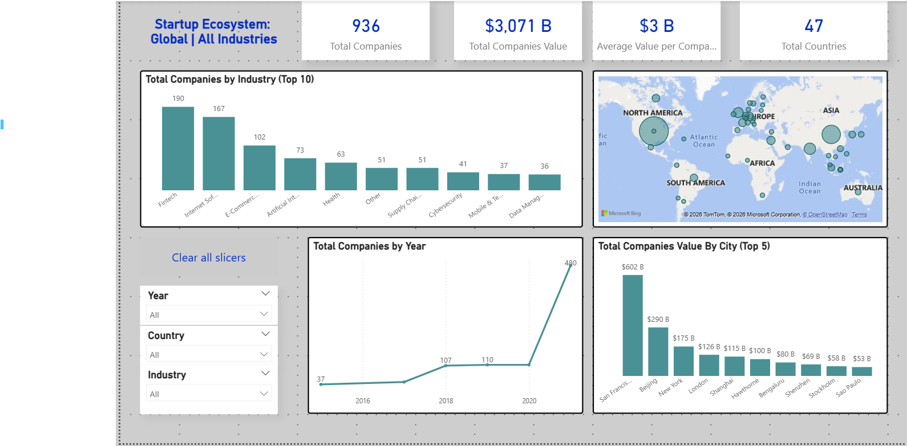

# Startup Investment Analysis

This project analyzes global startup investment trends using Python and Power BI.

The goal of the analysis is to identify patterns in startup funding, the industries receiving the most investment, and how funding has evolved over time.

---

## Project Overview

This project includes:

- Data exploration and analysis using Python
- Data cleaning and transformation using Pandas
- Visualization of investment trends
- Interactive dashboard built in Power BI

---

## Tools & Technologies

- Python
- Pandas
- NumPy
- Matplotlib
- Jupyter Notebook
- Power BI

---

## Dataset

The dataset contains information about startup investments, including:

- Startup name
- Industry
- Country
- Funding amount
- Investment year
- Investors

---

## Key Questions

This analysis explores questions such as:

- Which industries receive the most startup investment?
- How has startup funding changed over time?
- Which countries attract the most investment?

---

## Files in this Repository

- `startup_analysis.ipynb` → Python analysis notebook
- `startup_dashboard.pbix` → Power BI dashboard
- `startups.csv` → dataset used for analysis

---

## Dashboard Preview

---

## Author

Alexis Ulla  
Data Analysis Projects Portfolio

Update README with project description
